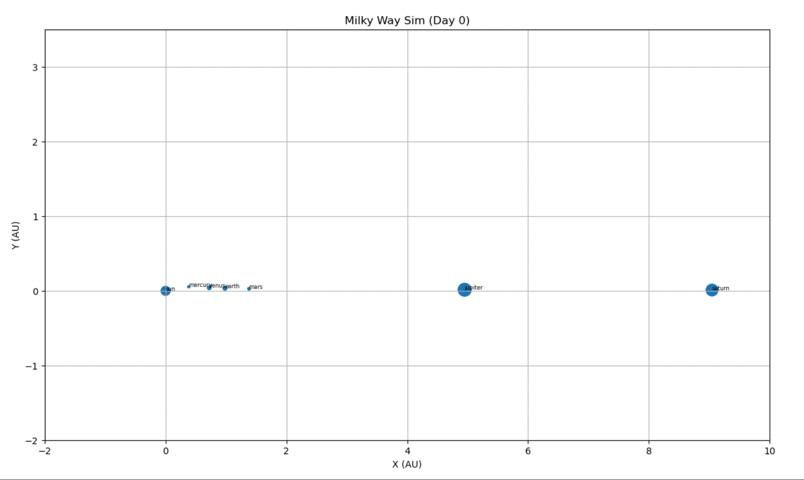

# particle-simulation-playground
Particle Simulation Playground: Exploring Random Motion, Interacting Bodies, and Orbital Physics

## Motivation

This mini-project was developed as a way to explore some of the principles of interacting systems using Numpy & Matplotlib. I'm sharing the notebook in hopes that others will find it semi-useful and/or educational. Feel free to explore, experiment, and have fun with the code!

## Overview

The notebook includes the following:

1. Random Particles: This demonstrates the motion of particles in a 2d space. Offers an illustration of a world where particles are independent of one another.

2. Orbital Physics: This model applies Newton's Law of Gravitation to simulate the physics of interacting bodies. By visualizing this, we can begin to can gain insights into the complex dynamics of interacting systems.

3. Milky Way Simulation: This model aims to combine the previous concepts to simulate the orbital physics of our solar system. Using Newton's Law of Gravitation and the principles of of physics we can explore the dynamics of celestial bodies.

## Getting Started

To run the notebook, you'll need:

- Python 3.x
- Jupyter Notebook
- Numpy + Matplotlib
