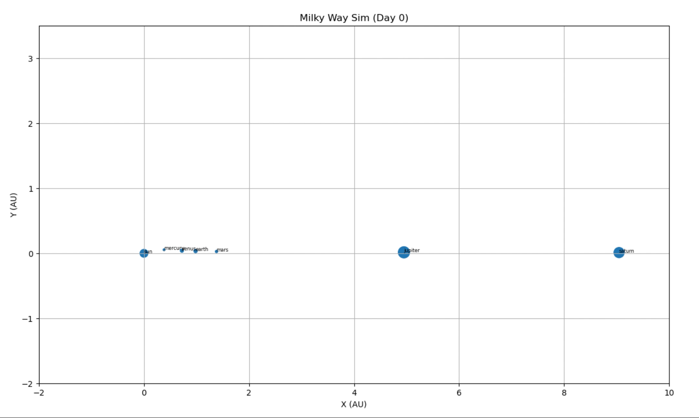

# Physics Simulation: Gravitational N-Body Problem

Interactive simulations of particle dynamics and orbital mechanics using numerical methods.



## Overview

This project implements physics simulations from first principles, progressing from simple particle motion to a full solar system model. The simulations demonstrate numerical integration techniques commonly used in scientific computing and game physics.

## Simulations

### 1. Independent Particle Motion

Basic 2D particle simulation with randomized initial conditions. Particles move independently without interaction forces.


### 2. N-Body Gravitational Simulation

Implements Newton's Law of Gravitation to simulate interacting bodies:

```
F = G × (m₁ × m₂) / r²
```

Bodies attract each other based on mass and distance, producing emergent orbital behavior and chaotic dynamics.


### 3. Solar System Model

Full orbital simulation using real planetary data (mass, orbital radius, velocity). Uses **Verlet integration** for numerical stability over long time periods—the same technique used in molecular dynamics and professional physics engines.


## Technical Highlights

- **Numerical Integration:** Verlet integration for accurate, energy-conserving physics
- **Vectorized Computation:** NumPy-based force calculations for O(n²) body interactions
- **Real-time Visualization:** Matplotlib animation with particle trails and scaling
- **Physical Accuracy:** Real planetary masses, distances, and orbital velocities

## Built With

- Python 3
- NumPy (vectorized physics calculations)
- Matplotlib (animation and visualization)
- Jupyter Notebook

## Run It

```bash
pip install numpy matplotlib jupyter
jupyter notebook notebook.ipynb
```

## Author

**Selim Cam** — [selimcam.dev](https://selimcam.dev) · [LinkedIn](https://linkedin.com/in/selimcam)
